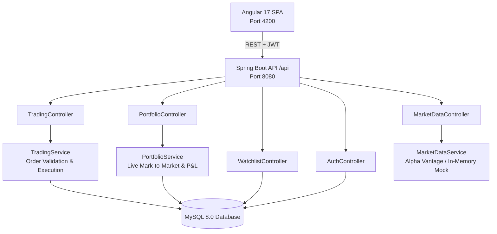

# PortfolioPro — Institutional Stock Trading & Portfolio Management Platform

A full-stack, enterprise-grade stock trading and portfolio management application built with **Java / Spring Boot 3**, **Angular 17**, and **MySQL**. Designed for active equities trading, real-time market data streaming, order execution, technical/fundamental analysis, and risk management.

---

## 🏛️ System Architecture



---

## 🌟 Key Features

### 1. ⚡ High-Frequency Trade Execution Desk
- **Order Types**: Instant **MARKET** orders and condition-based **LIMIT** orders.
- **Trade Routing**: Real-time order settlement, execution prices, slippage simulation, and 0-commission accounting.
- **Risk Checks**: Pre-trade purchasing power and cash balance validations to prevent overdrafts.
- **Order Audit Trail**: Complete execution ledger with order statuses (`EXECUTED`, `PENDING`, `CANCELLED`), timestamps, and trade receipts.

### 2. 📊 Real-Time Market Data & Live Tickers
- **Live Equities Feed**: Streaming stock prices for major tickers (AAPL, NVDA, MSFT, GOOGL, AMZN, TSLA, META, JPM).
- **Interactive SVG Charts**: Dynamic timeframes (`1D`, `1W`, `1M`, `1Y`) with gradient fills, volume, and high/low ranges.
- **Stock Search & Autocomplete**: Instant symbol search across global exchanges.

### 3. 📈 Technical & Fundamental Analysis Workbench
- **Technical Indicators**:
  - **RSI (14)** momentum oscillator with oversold/overbought zone visualization.
  - **Moving Averages**: 20-Day SMA, 50-Day SMA, and 200-Day Institutional SMA trend evaluation.
  - **MACD (12, 26, 9)** histogram & signal lines.
  - **Bollinger Bands** volatility channels.
- **Fundamental Metrics**:
  - P/E (Price-to-Earnings) Ratio vs Industry Benchmark.
  - Market Capitalization classifications (Mega-Cap, Large-Cap).
  - 52-Week High/Low dynamic price position meter.
  - Algorithmic consensus indicator (`STRONG BUY`, `BUY`, `NEUTRAL`, `SELL`).

### 4. 💼 Portfolio & Risk Management
- **Mark-to-Market Valuation**: Continuous recalculation of Unrealized P&L ($ and %) and Realized Gains.
- **Asset Allocation Breakdown**: Visual equity vs. cash distribution bar and individual holding concentration weights.
- **Portfolio Health & Diversification Rating**: Automatic portfolio beta estimation and concentration risk scoring.

### 5. ⭐ Custom Equities Watchlist
- Single-click watchlist pinning with real-time price change alerts.
- Direct "BUY" and "SELL" triggers from the watchlist interface.

---

## 🚀 Getting Started

### Prerequisites
- **Java 17 or higher** (Java 21/25 supported)
- **Node.js 18+ and npm** (for Angular frontend)
- **MySQL 8.0+** (running on `localhost:3306`)

---

### 1. Backend Setup (Spring Boot)

1. Open MySQL and ensure your database is reachable. The application will automatically create the `portfoliopro` database if it doesn't exist.
2. In `portfoliopro-backend/src/main/resources/application.properties`, update your MySQL password if needed:
   ```properties
   spring.datasource.username=root
   spring.datasource.password=your_password
   ```
3. Navigate to the backend directory and run:
   ```bash
   cd portfoliopro-backend
   mvn spring-boot:run
   ```
4. **Interactive Swagger API Documentation**:
   Once started, open:
   👉 `http://localhost:8080/api/swagger-ui.html`

---

### 2. Frontend Setup (Angular 17)

1. Navigate to the frontend directory:
   ```bash
   cd portfoliopro-frontend
   ```
2. Install dependencies:
   ```bash
   npm install
   ```
3. Start the Angular development server:
   ```bash
   npm start
   ```
4. Open your browser at:
   👉 `http://localhost:4200`

---

## 🔑 Pre-Seeded Demo Account

The application comes pre-loaded with an institutional demo account:
- **Username**: `trader_demo`
- **Password**: `Trader123!`
- **Starting Cash**: `$100,000.00`
- **Pre-Loaded Holdings**: AAPL (25 shares), NVDA (15 shares), MSFT (10 shares)
- **Pre-Configured Watchlist**: TSLA, AMZN, GOOGL

You can also click the **"Autofill Demo"** button on the login screen for instant 1-click access!

---

## 📁 Project Structure

```text
portfoliopro/
├── portfoliopro-backend/
│   ├── src/main/java/com/portfoliopro/
│   │   ├── config/            # SecurityConfig, WebClientConfig, OpenApiConfig, DataInitializer
│   │   ├── controller/        # Auth, MarketData, Trading, Portfolio, Watchlist REST controllers
│   │   ├── dto/               # Request & Response DTOs
│   │   ├── entity/            # User, Portfolio, Order, Watchlist JPA entities
│   │   ├── enums/             # OrderSide, OrderType, OrderStatus, Role
│   │   ├── repository/        # Spring Data JPA Repositories
│   │   ├── security/          # JwtTokenProvider, JwtAuthenticationFilter
│   │   └── service/           # Trading, Portfolio, MarketData, Watchlist services
│   └── src/main/resources/    # application.properties
│
└── portfoliopro-frontend/
    ├── src/
    │   ├── app/
    │   │   ├── components/    # Layout, Dashboard, Market, Trade, Portfolio, Orders, Watchlist, Analysis, Login, Register
    │   │   ├── guards/        # AuthGuard
    │   │   ├── models/        # TypeScript DTOs & Interfaces
    │   │   └── services/      # AuthService, MarketDataService, TradingService, PortfolioService, WatchlistService, AuthInterceptor
    │   ├── styles.css         # Institutional Dark Trading Design System
    │   └── index.html
    └── proxy.conf.json        # Angular API proxy to localhost:8080
```
